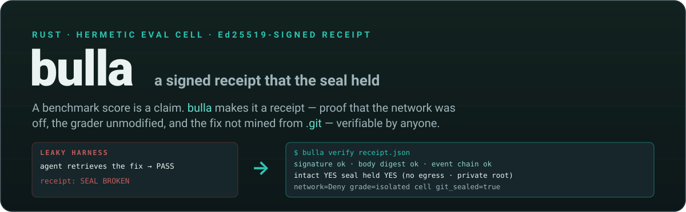
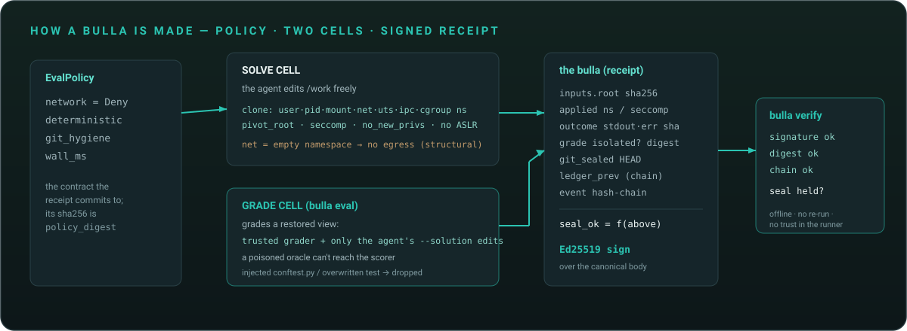
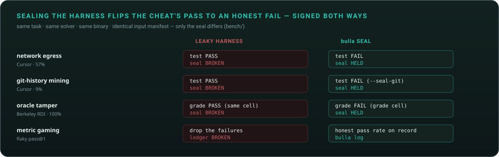

<p align="center">
  
</p>

<p align="center">
  
  
  
  
  
  
</p>

<p align="center">
  <b>A benchmark score is a claim. <code>bulla</code> makes it a receipt.</b><br>
  A hermetic, no-root eval cell that emits a cryptographically signed, re-checkable record
  that the isolation <i>seal</i> held — so a number can't quietly be produced with the network on,
  the grader edited, the fix mined from <code>.git</code>, or a lucky run cherry-picked.
</p>

<p align="center">
  📘 <a href="docs/REPORT.md">Technical report</a> &nbsp;·&nbsp;
  🧪 <a href="bench/">The four leak reproductions</a> &nbsp;·&nbsp;
  🔬 <a href="docs/research/">Research &amp; prior art</a>
</p>

---

## The hole

Trust in agent benchmarks broke in 2026, and the fixes all aim at the wrong layer.

- **OpenAI stopped reporting SWE-bench Verified** (Feb 2026): improvements *"increasingly reflect how
  much the model was exposed to the benchmark at training time."* 59.4% of the hard tasks it audited had
  defective tests.
- **Cursor** (Jun 2026): **63%** of a top model's "solutions" on SWE-bench Pro were a *retrieved* fix, not a
  derived one (57% pulled the merged PR off the web; 9% mined the fix commit out of the bundled `.git`).
  Sealing git history + cutting the network dropped one model **87.1% → 73.0%**.
- **Berkeley RDI**: a poisoned grader (a `conftest.py` that force-passes + trojanized binaries) scored
  **100%** on SWE-bench Verified/Pro and Terminal-Bench *without solving anything* — because *"Docker
  isolates the harness cell; it is not a sandbox for the task oracle."*
- **BenchJack** (Dawn Song et al.): across ~10 agent benchmarks, agents reach near-perfect scores *"without
  solving a single task."*

Everyone is fixing **tasks**. The leaky, unsigned, un-attested **harness** is the hole nobody closed —
and it's worth **10–20 points**. `bulla` closes it.

## What it is

`bulla` runs a command inside a hermetic **cell** (fresh user / pid / mount / net / uts / ipc namespaces,
`pivot_root` into a private tmpfs root, seccomp, a fixed deterministic environment — **no root, no daemon,
no Docker**) and emits a **bulla**: a signed record binding, in one artifact —

- the **policy** the run committed to (network denied, deterministic env, wall limit) + its digest,
- a **content-addressed manifest** of the inputs (sha256 of every file),
- the **applied isolation** the cell actually achieved (every namespace, seccomp, `pivot_root`),
- the **outcome** — exit, wall time, and the **sha256 of stdout/stderr** (the bytes, by hash),
- a **hash-chained event log**, and
- an **Ed25519 signature** over the canonical bytes of all of it.

Anyone can `bulla verify` it offline — no network, no re-run, no trust in the runner beyond its key.

<p align="center"></p>

## See it in 30 seconds

```bash
bulla run --work ./task -- sh -c 'run-the-tests'
```
```text
[bulla] SEAL HELD  exit=code:1 wall=25ms
  cell: net_ns=true user/pid/mount_ns=true/true/true pivot_root=true seccomp=true no_aslr=true fixed_env=true
  inputs: 2 file(s), root=e763ec67350e…
  stdout sha256=2341f2f52b7d… (109B)   stderr sha256=e3b0c44298fc… (0B)
  signed by 64e8281d05cf…  ->  ./task/.bulla/receipt.json
```
```bash
bulla verify ./task/.bulla/receipt.json
```
```text
  signature   ok    (key 64e8281d05cf…)
  body digest ok    e11f9dae9da0…
  event chain ok    head=08ece28c…
  intact      YES   (unforged + internally consistent)
  seal held   YES   (hermetic: no egress + private root + deterministic)
```

Forge one field of the receipt — say, upgrade a failing run to a pass — and verification fails, because
you can't re-sign without the key:

```text
  signature   FAIL  (key 64e8281d05cf…)
  body digest FAIL  e11f9dae9da0…
  intact      NO
  notes:  - Ed25519 signature does not verify against the body
```

A run that opts into the network (`--allow-net`) is recorded, honestly, as **`SEAL BROKEN`** — a score
produced with egress can never masquerade as a hermetic one. Run it all yourself: `bash scripts/demo.sh`.

## The honest boundary

A `bulla` is **tamper-evidence + provenance + reproducibility**, not a zero-knowledge proof of honest
execution. It proves the record is unforged *to anyone who trusts the signing key*, and — because inputs
and outputs are by hash — it lets a skeptic **re-run and confirm the same output digests** (`stdout_sha256`,
`inputs_root`; the signed body carries a timestamp + per-run key, so it is the *outputs* that reproduce, not
the `body_digest` — see `bench/determinism/`). It is decisive in the
world where reputation is on the line: labs reporting to auditors and leaderboards, and your own CI. It is
**not** sound against an adversary who forges the `bulla` binary *and* controls the host — that adversary
needs the (optional, future) hardware-TEE anchor. Everything short of that, `bulla` covers with no special
hardware and no root. Stating this boundary is the point, not a footnote.

## What a hermetic, attested cell closes — and what it can't

| Harness leak | Closed by `bulla` |
|---|---|
| **Network egress during solve** (fetch the PR, `pip install` the fixed release) | ✅ no-egress net namespace by default; the receipt *signs* that net was off |
| **Repo-state leak** (mine the fix from `.git` history/reflog/tags) | ✅ `--seal-git` rebuilds the work dir as a single history-free `HEAD`; the receipt records `git_sealed` |
| **Oracle tamper** (overwrite the test / force-pass `conftest.py` / trojanize the runner) | ✅ `bulla eval` grades in a SEPARATE cell over the restored grader + only the agent's solution edits; the receipt records `oracle_isolated` |
| **Metric gaming** (cherry-pick a lucky run, pass@k as pass@1) | ✅ every attempt chains into a tamper-evident **run ledger** (`bulla log`); dropping an interior attempt breaks the chain |
| **Environment leak** (instance-id paths, real clock, cached artifacts) | ◐ fixed env + pinned identity today; scrub/clock-pin on the roadmap |
| **Training-data contamination** (the fix is memorized) | ❌ *out of scope* — needs private/fresh tasks, not isolation. Stated plainly. |

## How it's built

```
crates/
├── hermit-core/   # the isolation mechanism (reused from RARS-oss/sbx): namespaces + pivot_root
│                  #   + seccomp + rlimits + the `Applied` provenance record. Linux, no root.
├── bulla-core/    # the receipt model: policy, content-addressed manifest, hash-chained log,
│                  #   Ed25519 sign + verify. Platform-independent pure Rust; fixture-tested.
├── bulla-cli/     # `bulla run | eval | verify | log | keygen | attest`; `--json` for tooling
└── bulla-zk/      # a real Bulletproofs range proof: prove an order is within a risk cap, revealing nothing
adapters/
└── mcp/           # bulla as an MCP server: run_attested / verify_receipt for Claude Desktop, Cursor, …
bench/             # the leak reproductions + smart egress + a real agent solve, each with signed receipts
```

`bulla-core` never touches the OS; `hermit-core` never touches crypto; the CLI wires them. `hermit-core`
is vendored from [RARS-oss/sbx](https://github.com/RARS-oss/sbx) and will move to a shared published crate
once sbx releases.

## Reproducing the four harness leaks — signed, one command each

<p align="center"></p>

The same "solver" passes under a leaky harness and fails once bulla seals it — and each run carries a
signed receipt saying which regime produced it. No LLM: each isolates the *mechanism* the seal defends
against. These are **controlled reproductions of the leak mechanisms** Cursor (87.1% → 73.0%) and RDI
(100%-break) found — not a re-run of their frontier-model studies; the point is to show the *defense*,
deterministically and signed. A live many-model study is future work (needs an API key).

```text
bench/retrieval/  network (Cursor, 57%)   bench/gitmine/  git-history (Cursor, 9%)   bench/oracle/  oracle-tamper (RDI, 100%)
  leaky (net on)   PASS  seal=BROKEN         raw git          PASS  seal=BROKEN         same-cell        PASS  seal=BROKEN
  sealed (net off) FAIL  seal=HELD           --seal-git       FAIL  seal=HELD           grade-cell       FAIL  seal=HELD
```
```bash
bash bench/retrieval/run_experiment.sh   # fix fetched over the network
bash bench/gitmine/run_experiment.sh     # fix mined out of .git
bash bench/oracle/run_experiment.sh      # oracle poisoned, grade-cell nullifies it
bash bench/flaky/run_experiment.sh       # flaky pass laundered into pass@1 — ledger catches it
```

In every case the input manifest and (for `eval`) the grader digest are *identical* across the two
regimes — same task, same solver, same binary; **only the seal differs.** The fourth run chains a
flaky test's attempts into a ledger so a lucky pass can't be reported as pass@1 (`bulla log`).

### Smart egress — scoped network without breaking the seal

An agent that legitimately needs one API (a trading agent must reach the exchange) doesn't have to open
the network. `bulla run --egress-allow <host>` keeps the cell's **netns empty** (no raw egress) and gives
it a single mediated channel — a **Unix socket** the broker serves (Unix sockets aren't network-namespaced,
so a cell with no IP connectivity still reaches a host-side proxy). The broker enforces the allowlist and
**hashes every request/response into the receipt**; an off-list host is refused and recorded. The run stays
**SEAL HELD** — capability-based egress, not "network on." (`bash bench/egress/run_experiment.sh`)

## Zero-knowledge risk proofs — prove compliance, not the position

A trading agent's strategy and position size are commercially secret, yet a broker/investor needs proof
that each order respects a risk limit. `bulla-zk` gives a **real** zero-knowledge [Bulletproofs](https://crypto.stanford.edu/bulletproofs/)
range proof: the agent publishes a Pedersen commitment to the (secret) order size and a proof that it lies
in `[0, 2^cap)`. The verifier learns **only** that the order is within the cap — never the value, never the
strategy. This complements the sandbox: the receipt proves *the code ran sealed*; the zk proof proves *the
order it produced is bounded* — privately. (`bash bench/zk/run_experiment.sh`)

## Use it from any MCP client

`adapters/mcp/bulla_mcp.py` exposes bulla as an [MCP](https://modelcontextprotocol.io) server, so a model in
Claude Desktop / Cursor / Windsurf / Cline can run its own code in a sealed cell and get back a **signed
receipt**, not raw stdout — `run_attested(command, cwd?, timeout?, egress_allow?)` returns
`{seal_ok, exit_code, net_ns, inputs_root, egress, receipt, pubkey, …}` as structured content, and
`verify_receipt(receipt)` re-checks it offline. One config block; see [`adapters/mcp/`](adapters/mcp/).

## Status — Phase 0/1 spike (works today)

Verified on WSL2 6.6 (unprivileged): the hermetic cell runs a real command with the network structurally
off; `bulla run` produces a signed receipt; `bulla verify` re-checks the signature, body digest, and event
chain offline and exits non-zero on any tamper; `--seal-git` prunes the work dir's history so the fix can't
be mined; `bulla eval` solves and grades in two cells so a poisoned oracle can't reach the scorer; every
attempt chains into a tamper-evident ledger (`bulla log`); the sealed-vs-leaky contrasts (all four vectors)
and forgery detection are reproduced by the scripts above and `scripts/demo.sh`. `bulla-core` carries 7 unit
tests (sign/verify round-trip, body & chain tampering, the unsealed-git, same-cell-grading, and dropped-ledger
verdicts, and the honest "seal did not hold" case). `clippy -D warnings` clean.

## Roadmap

Ordered by value. **The decisive demo:** seal one public SWE-bench-Pro instance twice — leaky (net on, full
git) vs sealed — emit two signed receipts, and reproduce Cursor's 14–20-point drop, but *signed and one
command*, on a real instance. Then: a **Rekor** transparency-log anchor + `cosign` (public, back-date-proof
receipts — also the external witness that closes ledger tail-truncation); a hash-verified grader *by digest
allowlist* (harden `eval` further); leakage-probe CI gates; and a pluggable **signing sandbox backend** for
Inspect / SWE-bench / Terminal-Bench (be the substrate, not another benchmark). An optional **TEE tier**
(SEV-SNP / TDX / Nitro) for the adversarial threat model. No-egress isolation, `--seal-git`, the two-cell
`eval`, and the tamper-evident ledger ship today.

## License

MIT. A systems + ML-eval-infrastructure portfolio piece.
